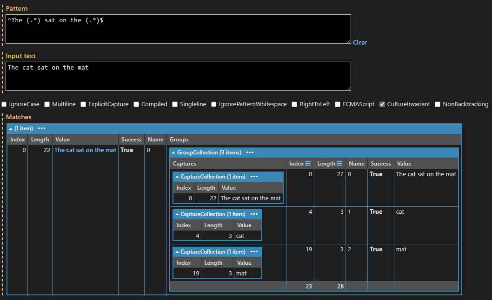
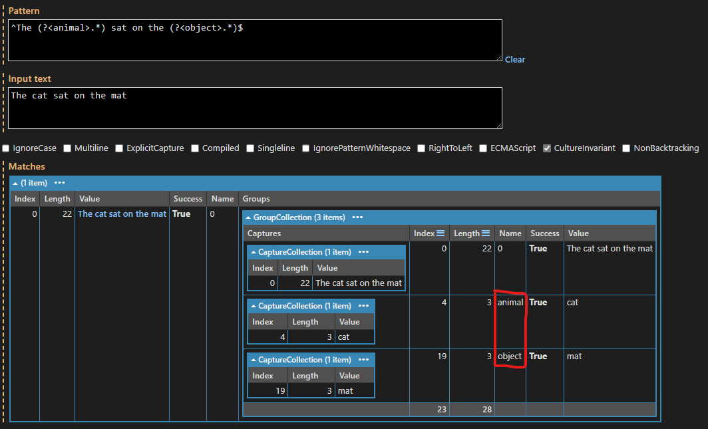
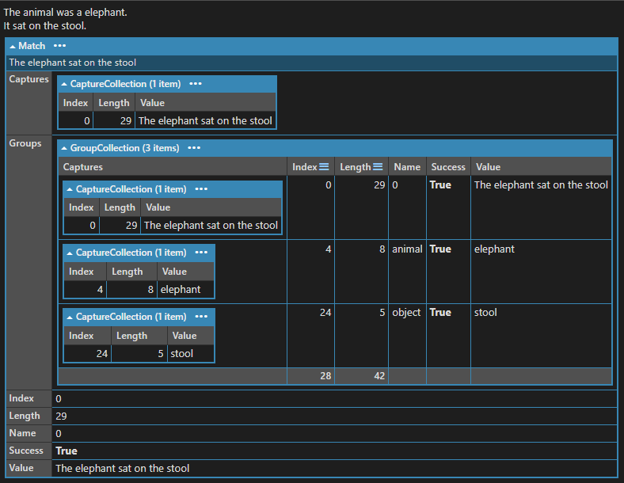
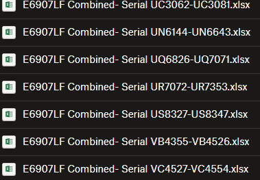

# Using .NET Regular Expressions to Filter, Parse and Validate Text

[TOC]

## Introduction 
Regular expressions are an extremely powerful tool for parsing and filtering input, although they are somewhat opaque and difficult to use. Nevertheless, regular expressions can be used to great effect when parsing and filtering input streams 

This is the technique I have refined that works particularly well with the `OSL.OceanProtocol` library as an aide to building transaction and response classes. However the technique is useful in many situations where some textual input stream needs to be parsed or filtered.

## Regular Expression Options

The default options for a regular expression are not necessarily optimal for our purposes. Therefore, when creating a regular expression matcher, explicit options should be set like so:

```csharp
    private const RegexOptions MatchOptions = RegexOptions.ExplicitCapture | RegexOptions.Compiled | RegexOptions.CultureInvariant;
    private static readonly Regex ResponseMatcher = new(pattern, MatchOptions);
```

The options used here are the ones I find most useful:

- `RegexOptions.ExplicitCapture` - disables implicit capturing and only captures matches that are explicitly requested (see [Capture Groups](capture-groups) below).
- `RegexOptions.Compiled` causes the regular expression to be compiled to a state machine the first time it is used, and cached for subsequent uses. This greatly increases performance for any matcher that is likely to be used more than once, because the state-machine generation is expensive. This works best if the `RegEx` object is declared `static readonly` as in the code fragment above.
- `RegexOptions.CultureInvariant` prevents the user's UI culture from affecting the results. Internal storage and comparisons should normally be performed using the Invariant Culture unless there is a compelling reason otherwise, because responses from devices are almost always not culture-aware. Ocean Protocol strings, for example, use 7-bit ASCII encoding, and match results should never vary due to the system culture.

## Capture Groups

When a regular expression matches a part of the input string, it _captures_ the matched text into a _capture group_. This allows for easier access to the various parts of the match input text, and with thoughtful construction of the regular expression to leverage capture groups, this can be used to great effect when parsing input text streams.

The first capture group, index 0, contains the entire matched part of the input string, while additional capture groups contain anything matched by a parenthesized segment of the pattern. Note that capture groups may be nested.

For example, the expression:

```regex
^The (.*) sat on the (.*)$
```

produces three captures, as follows:



> _Output captured from [LINQPad][linqpad]_ which has a useful Regular Expression evaluation tool.

## Implicit Capture vs. Explicit Named Capture

This is already somewhat useful, but there are potential problems. Expressions can often generate a lot of captures and the numbering can be a bit unexpected and difficult to relate back to the original pattern. Plus, if the expression changes in the future, the numbering scheme could change, breaking any code that relies on it. Therefore, this default behaviour is best avoided where possible.

 we can do better, using _named captures_. We can turn on `RegexOptions.ExplicitCapture` and use _named captures_ to only capture the matches we want, and then access them by name instead of number.

 Capture groups are anything in parentheses: `(\d*)` matches a sequence of zero-or-more decimal digits.

 We can make this an _named capture_ using the form `(?<name>pattern)`, as in the following example:

 

 Note that we now have two _named captures_, "animal" and "object", but we also still have an implicit numbered capture that contains the entire match string. Capture 0 is always present and cannot be turned off by  the `RegexOptions.ExplicitCapture` option.

 Named captures can be accessed using the `Groups[]` indexer with a string as the index: `match.Groups["name"]`. The matched string is obtained from the `match.Groups["name"].Value` property. The existence or absence of a match can be tested with the `match.Groups["name"].Success` property. Finally, the overall success of the match can be tested with the `match.Success` property.

 A code example showing the use of named explicit capture groups to extract data from an input string:

 ```csharp
 var input = "The elephant sat on the stool";
var pattern = @"^The (?<animal>.*) sat on the (?<object>.*)$";
var options = RegexOptions.Compiled | RegexOptions.CultureInvariant | RegexOptions.ExplicitCapture;
var animalMatcher = new Regex(pattern, options);
var match = animalMatcher.Match(input);
if (match.Success)
{
    Console.WriteLine($"The animal was a {match.Groups["animal"].Value}.");
    Console.WriteLine($"It sat on the {match.Groups["object"].Value}.");
}
```

Produces output:



This trivial example demonstrates a very powerful technique for filtering, parsing and validating input streams.

## Real World Example

As a more detailed example, consider the following scenario.

A temperature-controlled crystal oscillator device manufactured by Rakon has a unique serial number within the part number. Device calibration data is supplied in batches in Excel worksheet format. Each Excel document contains data for a range of device serial numbers and is named for the range of serial numbers it contains, plus the device part number and other metadata. It is necessary to locate the data for a specific device from amongst the many Excel documents, by searching the file names. The Excel documents are named like so:



Each device has a part number, e.g. "E6907LF" and a unique serial number, e.g. "UN6144". Given a device part number and serial number, the following code uses a regular expression with explicit named captures to locate and open the required Excel document, based on its filename.

```csharp
private const string RakonDataFilePattern =
    @"(?<Device>E\d{4}LF) .*Serial (?<RangeLower>[A-Z]{2}\d{4})-(?<RangeUpper>[A-Z]{2}\d{4}).xlsx";

private const RegexOptions RegexMatchOptions =
    RegexOptions.Compiled | RegexOptions.CultureInvariant | RegexOptions.ExplicitCapture;

private static readonly Regex RakonDataFileMatcher = new(RakonDataFilePattern, RegexMatchOptions);

/// <inheritdoc />
public Maybe<RakonData> LoadRakonData(Product product, RakonSerialNumber rakonSerial)
{
    var rakonPartNumber = RakonPartNumberForProduct(product);
    var rakonDataLocation = dataFileProvider.RakonDataDirectory(product);
    var xlsxFiles = storageProvider.EnumerateFilesInDirectory(rakonDataLocation, "*.xlsx").ToList();
    // Query the list of file names for one which:
    // 1. matches the Rakon device part number;
    // 2. Covers a range of serial numbers that includes the device of interest.
    var xlsxFileForRakonDevice = from file in xlsxFiles
        let match = RakonDataFileMatcher.Match(file)
        where match.Success
        where match.Groups["Device"].Value == rakonPartNumber
        let lowLimit = RakonSerialNumber.FromString(match.Groups["RangeLower"].Value)
        let highLimit = RakonSerialNumber.FromString(match.Groups["RangeUpper"].Value)
        where rakonSerial.IsInRange(lowLimit, highLimit)
        select file;
    var filesContainingRakonSerial = xlsxFileForRakonDevice.ToList();
    if (!filesContainingRakonSerial.Any())
    {
        return Maybe<RakonData>.Empty;
    }

    if (filesContainingRakonSerial.Count() > 1)
    {
        return Maybe<RakonData>.Empty;
    }

    var dataFile = filesContainingRakonSerial.Single();
    var maybeRakonData = ExtractRakonDataFromExcelFile(rakonSerial, dataFile);
    return maybeRakonData;
    }
```

The above code works by:

- Enumerating all the `*.xlsx` files in a well-known directory.
- Creating a LINQ query to select any files that may contain data for the device:
  - the LINQ query first uses a the regular expression to match the input file name, and determine whether it has a name in the expected format using `where match.Success`.
  - rejects any files related to the wrong device: `where match.Groups["Device"].Value == rakonPartNumber`
  - extracts the range of serial numbers covered, and uses them to test whether the device is within the range:

  ```csharp
    let lowLimit = RakonSerialNumber.FromString(match.Groups["RangeLower"].Value)
    let highLimit = RakonSerialNumber.FromString(match.Groups["RangeUpper"].Value)
    where rakonSerial.IsInRange(lowLimit, highLimit)
  ```
  - Selects any matching file names: `select file;`
- Runs the LINQ query and verifies that exactly one matching file was found.
- Loads the data from the file.

## Conclusions

- Regular expressions offer a very powerful tool for filtering, parsing and validating textual input data.

- The use of explicit named captures simplifies the extraction of data from a matched pattern.

- Although regular expressions are somewhat opaque and difficult to work with, there are tools to help with this:
  - **[ReSharper][resharper]** (Jetbrains) has particularly good support and offers syntax colouring of regular expression strings and smart completion of capture group names. It also has a screen for developing and testing testing regular expressions against input strings.
  - **[LINQPad][linqpad]** (free version available) also has good support for developing and testing expressions and is useful for lots of other things, such as developing database queries and quickly trying out bits of code.
  - **[Regulator and ReguLazy][osherove]** (Roy Osherove) - somewhat dated and clunky but nevertheless still useful regular expression utilities.

[linqpad]: https://www.linqpad.net/ "The .NET Programmer’s Playground"
[osherove]: https://osherove.com/tools/ "Tools by Roy Osherove"
[resharper]: https://www.jetbrains.com/resharper/ "JetBrains ReSharper"